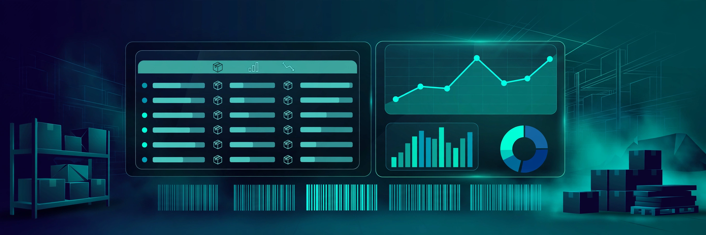

<div align="center">

# My-Projects


**My collection of full-stack projects. Currently home to a Stock Management System — an inventory app with an Express + MongoDB backend and a plain HTML/CSS/JS frontend.**



</div>

---

## What's inside

### Stock Management System (`stock-management-system/`)

A complete inventory management app: log in, add/update/delete stock items, and review a history of every change.

**Features**
- JWT-based login protecting all API routes
- Full item CRUD (`GET/POST/PUT/DELETE /api/items`)
- Change-history log (`/api/history`) tracking every inventory update
- Security middleware — Helmet, CORS, and request rate limiting
- Password hashing with bcryptjs
- Three-page frontend (dashboard, login, product history) served directly by Express
- MongoDB via Mongoose with a dedicated connection module

**Tech stack**

| Layer | Tech |
|---|---|
| Backend | Express.js, Node.js |
| Database | MongoDB + Mongoose |
| Auth | JSON Web Tokens (jsonwebtoken), bcryptjs |
| Security | Helmet, CORS, express-rate-limit |
| Frontend | Plain HTML, CSS, JavaScript (no framework) |

## Run it locally

You'll need Node.js and a MongoDB connection string.

```bash
# 1. Clone the repo
git clone https://github.com/hussnainahmedd/My-Projects.git
cd My-Projects/stock-management-system/backend

# 2. Install dependencies
npm install

# 3. Configure the backend
# Create a .env file with:
#   MONGODB_URI=<your MongoDB connection string>
#   SECRET_KEY=<a random secret for JWT signing>
#   PORT=5000

# 4. Start the server
node app.js
```

Open `http://localhost:5000` — the server serves the frontend itself, no separate frontend build needed.

## Project structure

```
stock-management-system/
├── backend/
│   ├── app.js            # Express app, API routes, static file serving
│   ├── config/db.js      # Mongoose connection
│   ├── controllers/      # Item CRUD logic
│   ├── models/           # Item, User, History schemas
│   └── middleware/       # JWT auth, security headers, error handling
└── frontend/
    ├── index.html        # Dashboard — add & update items
    ├── login.html        # Login page
    └── product-history.html  # Change history view
```

## Contact

**Hussnain Ahmad** — BSCS student & builder, Air University, Islamabad

GitHub: https://github.com/hussnainahmedd
